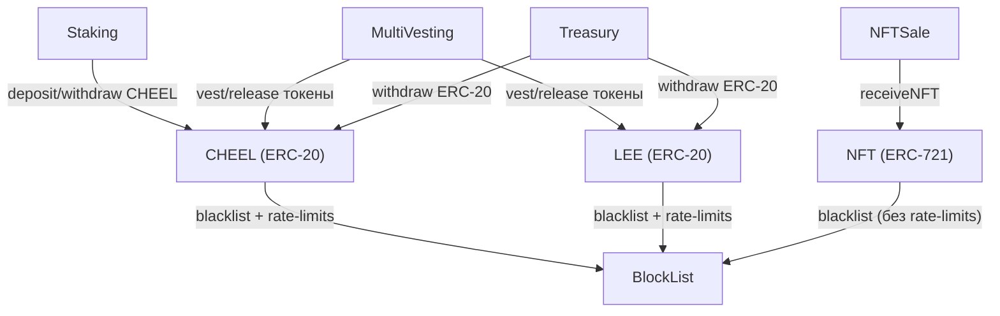

# Cheelee — Экосистема смарт-контрактов

## Общие сведения

- **Проект:** Cheelee — Web3 платформа коротких видео
- **Блокчейн:** BSC (Binance Smart Chain)
- **Язык:** Solidity `^0.8.17`
- **Фреймворк:** Hardhat
- **Паттерн:** Все контракты — **upgradeable** (OpenZeppelin Transparent Proxy), кроме `MultiVesting` и `NFTSale` (обычные контракты)
- **Мультисиг:** Ownership переводится на Gnosis Safe при деплое

---

## Стек и зависимости

| Зависимость | Версия | Назначение |
|---|---|---|
| `@openzeppelin/contracts` | `^4.7.3` | Базовые контракты (ERC20, ERC721, Ownable, AccessControl, EIP712) |
| `@openzeppelin/contracts-upgradeable` | `^4.7.3` | Upgradeable версии (ERC20VotesUpgradeable, ERC721EnumerableUpgradeable) |
| `hardhat` | `^2.12.6` | Фреймворк разработки |
| `ethers` | `^5.7.2` | Взаимодействие с блокчейном |
| `@typechain/hardhat` | `^6.1.4` | Генерация TypeScript-типов |
| `chai` + `mocha` | | Тестовый фреймворк |
| `@openzeppelin/test-helpers` | `^0.5.16` | Утилиты тестирования (time, expectRevert) |
| `solidity-coverage` | `^0.8.2` | Покрытие тестами |
| `hardhat-gas-reporter` | `^1.0.9` | Отчёт о газе |

---

## Карта контрактов

| Контракт | Тип | Upgradeable | Назначение |
|---|---|---|---|
| `CHEEL.sol` | ERC-20 + Votes | ✅ | Governance-токен, supply ≤ 1 млрд, burn, blacklist, rate-limits |
| `LEE.sol` | ERC-20 + Permit | ✅ | Utility-токен, supply ≤ 7 млрд, burn, blacklist, rate-limits |
| `NFT.sol` | ERC-721 Enumerable | ✅ | NFT-очки/кейсы, mint/transfer, blacklist |
| `BlockList.sol` | Utility | ✅ | Глобальный/внутренний блок-лист, rate-limits, exclusion list |
| `Staking.sol` | DeFi | ✅ | Стейкинг CHEEL с APY-планами, lock-периоды, сбор наград по пятницам |
| `MultiVesting.sol` | DeFi | ✅ | Линейный вестинг, множественные расписания, two-step смена бенефициара, аварийный вывод |
| `Treasury.sol` | Финансы | ✅ | Вывод ERC-20 токенов на фиксированный адрес (recipient), управление списком токенов |
| `NFTSale.sol` | Продажи | ❌ | Продажа/получение NFT по EIP-712 подписи, лимиты supply |

---

## Описание контрактов и функций

### 1. CHEEL.sol

**Наследование:** `ICHEEL`, `ERC20VotesUpgradeable`, `OwnableUpgradeable`

Governance-токен экосистемы Cheelee. Максимальный supply ограничен 1 млрд токенов (10^9 × 10^18). Поддерживает голосование (ERC20Votes) и делегирование. Интегрирован с `BlockList` для блок-листа и rate-limits.

| Функция | Доступ | Описание |
|---|---|---|
| `initialize()` | initializer | Инициализация: имя "CHEELEE", символ "CHEEL", ERC20Permit, ownership → Gnosis |
| `mint(address _to, uint256 _amount)` | onlyOwner | Минт токенов. Проверяет `totalSupply() + _amount <= MAX_AMOUNT` |
| `burn(uint256 _amount)` | onlyOwner | Сжигание токенов со счёта owner (`_burn(msg.sender, _amount)`) |
| `setBlacklist(IBlockList _blockList)` | onlyOwner | Установка адреса контракта BlockList |
| `_beforeTokenTransfer(from, to, amount)` | internal | Хук: проверяет глобальный и внутренний блок-лист, вызывает `limitAllows()` для rate-limits |
| `_approve(owner, spender, amount)` | internal | Хук: проверяет блок-лист при approve операциях |

**Константы:**
- `MAX_AMOUNT` = 10^9 × 10^18 (1 млрд токенов)
- `GNOSIS` = `0x126481E4E79cBc8b4199911342861F7535e76EE7`

---

### 2. LEE.sol

**Наследование:** `ILEE`, `ERC20PermitUpgradeable`, `OwnableUpgradeable`

Utility-токен экосистемы. Максимальный supply — 7 млрд токенов. Поддерживает ERC20Permit (gasless approvals). Структура идентична CHEEL, но без Votes.

| Функция | Доступ | Описание |
|---|---|---|
| `initialize()` | initializer | Инициализация: имя "CHEELEE Attention Token", символ "LEE", ownership → Gnosis |
| `mint(address _to, uint256 _amount)` | onlyOwner | Минт токенов. Проверяет `totalSupply() + _amount <= MAX_AMOUNT` |
| `burn(uint256 _amount)` | onlyOwner | Сжигание токенов со счёта owner |
| `setBlacklist(IBlockList _blockList)` | onlyOwner | Установка адреса BlockList |
| `_beforeTokenTransfer(from, to, amount)` | internal | Хук: blocklist + rate-limits (аналогично CHEEL) |
| `_approve(owner, spender, amount)` | internal | Хук: проверка блок-листа при approve |

**Константы:**
- `MAX_AMOUNT` = 7 × 10^9 × 10^18 (7 млрд токенов)
- `GNOSIS` = `0xE6e74cA74e2209A5f2272f531627f44d34AFc299`

---

### 3. NFT.sol

**Наследование:** `ICustomNFT`, `ERC721EnumerableUpgradeable`, `OwnableUpgradeable`

NFT-контракт для очков и кейсов. Поддерживает минт по ролям (sale/treasury), enumeration, blacklist. Без rate-limits (расхождение с ТЗ).

| Функция | Доступ | Описание |
|---|---|---|
| `initialize(string _name, string _symbol)` | initializer | Инициализация: имя/символ, ownership → Gnosis |
| `receiveNFT(address _to, uint256 _tokenId)` | nftSale / treasury | Минт или трансфер NFT. Если `_tokenId` существует — `safeTransferFrom`, иначе — `_safeMint` |
| `safeMint(address _to, uint256 _tokenId)` | onlyOwner | Прямой минт NFT owner-ом |
| `setUri(string _uri)` | onlyOwner | Установка baseURI для метаданных |
| `setNftSaleAndTreasury(address _nftSale, address _treasury)` | onlyOwner | Установка адресов Sale и Treasury контрактов (проверка ≠ address(0)) |
| `tokensOwnedByUser(address _addr)` | view | Возвращает массив tokenId, принадлежащих пользователю |
| `setBlacklist(IBlockList _blockList)` | onlyOwner | Установка адреса BlockList |
| `_beforeTokenTransfer(from, to, tokenId)` | internal | Хук: проверка глобального и внутреннего блок-листа (**без rate-limits**) |
| `_approve(to, tokenId)` | internal | Хук: проверка блок-листа при approve |
| `_setApprovalForAll(owner, operator, approved)` | internal | Хук: проверка блок-листа при setApprovalForAll |

**Константы:**
- `GNOSIS` = `0xC40b7fBb7160B98323159BA800e122C9DeD0668D`

---

### 4. BlockList.sol

**Наследование:** `IBlockList`, `OwnableUpgradeable`, `AccessControlUpgradeable`

Центральный контракт безопасности. Управляет глобальным и per-token блок-листами, rate-limits (income/outcome per-token), exclusion list.

#### Блок-лист

| Функция | Доступ | Описание |
|---|---|---|
| `addUsersToBlockList(address[] _users)` | BLOCKLIST_ADMIN | Добавление пользователей в глобальный блок-лист |
| `removeUsersFromBlockList(address[] _users)` | BLOCKLIST_ADMIN | Удаление из глобального блок-листа |
| `addUsersToInternalBlockList(address _token, address[] _users)` | BLOCKLIST_ADMIN | Добавление в блок-лист конкретного токена |
| `removeUsersFromInternalBlockList(address _token, address[] _users)` | BLOCKLIST_ADMIN | Удаление из per-token блок-листа |
| `userIsBlocked(address _sender, address _from, address _to)` | view | Проверка: `globalBlockList[_sender] \|\| globalBlockList[_from] \|\| globalBlockList[_to]` |
| `userIsInternalBlocked(address _token, address _sender, address _from, address _to)` | view | Проверка per-token блок-листа |
| `usersFromListIsBlocked(address _token, address[] _users)` | view | Возвращает массив заблокированных из списка |

#### Rate-limits

| Функция | Доступ | Описание |
|---|---|---|
| `setTokenLimits(address _token, uint256 daily/monthlyIncome, uint256 daily/monthlyOutcome)` | BLOCKLIST_ADMIN | Установка лимитов по токену (4 значения: дневной/месячный income/outcome) |
| `changeDisablingTokenLimits(address _token, bool daily/monthlyIncome, bool daily/monthlyOutcome)` | BLOCKLIST_ADMIN | Включение/выключение конкретных типов лимитов |
| `limitAllows(address _from, address _to, uint256 _amount)` | external | Проверка и обновление лимитов. `msg.sender` = адрес токена. Проверяет outcome для `_from`, income для `_to`. Исключает адреса из `contractsExclusionList` |
| `getTokenLimits(address _token)` | view | Возвращает `TokenLimit` (dailyIncome, monthlyIncome, dailyOutcome, monthlyOutcome) |
| `getUserTokenTransfers(address _token, address _user)` | view | Текущие объёмы переводов пользователя (4 значения) |
| `getUserRemainingLimit(address _token, address _user)` | view | Оставшийся лимит пользователя (4 значения) |
| `getCurrentDay()` / `getCurrentMonth()` | view | Текущий календарный день/месяц (для трекинга лимитов) |

#### Exclusion List

| Функция | Доступ | Описание |
|---|---|---|
| `addContractToExclusionList(address _contract)` | BLOCKLIST_ADMIN | Добавление в exclusion list (освобождение от rate-limits) |
| `removeContractFromExclusionList(address _contract)` | BLOCKLIST_ADMIN | Удаление из exclusion list |

**Роли:**
- `BLOCKLIST_ADMIN_ROLE` — управление блок-листами и лимитами

**Структуры данных:**
- `TokenLimit` — лимиты: `dailyIncome`, `monthlyIncome`, `dailyOutcome`, `monthlyOutcome`
- `TokenTransfers` — текущие объёмы: `income`, `outcome`
- `TokenLimitDisabling` — флаги включения: `hasDailyIncomeLimit`, `hasMonthlyIncomeLimit`, `hasDailyOutcomeLimit`, `hasMonthlyOutcomeLimit`

---

### 5. Staking.sol

**Наследование:** `OwnableUpgradeable`

Стейкинг CHEEL-токенов с фиксированными APY-планами. 3 предустановленных плана с разными lock-периодами, min/max суммами и процентными ставками. Награды собираются только по пятницам.

| Функция | Доступ | Описание |
|---|---|---|
| `initialize(IERC20Upgradeable _token)` | initializer | Инициализация с 3 планами: 30д/9% APY/150-1000, 90д/12%/1000-4500, 180д/16%/4500-∞ |
| `deposit(uint256 _amount, uint256 _option)` | external | Внесение токенов. Проверки: опция не на паузе, нет активного стейка, сумма в диапазоне. Регистрирует пользователя |
| `withdraw(uint256 _option)` | external | Вывод стейка + наград. Проверка: lock-период истёк |
| `collect(uint256 _option)` | external | Сбор наград **только по пятницам** (`(timestamp / 86400 + 4) % 7 == 5`). Lock-период должен истечь для начисления |
| `earned(address _addr, uint256 _option)` | view | Расчёт заработанных токенов: `(balance * apy / 100 - balance) * timePassed / SECONDS_PER_YEAR` |
| `setOption(uint256 _option, lockPeriod, apy, min, max)` | onlyOwner | Обновление параметров плана |
| `addOption(lockPeriod, apy, min, max)` | onlyOwner | Добавление нового плана стейкинга |
| `setOptionState(uint256 _option, bool _state)` | onlyOwner | Пауза/активация плана |
| `getRegisteredUsers()` | view | Список зарегистрированных пользователей |
| `getRegisteredUsersSize()` | view | Количество пользователей |
| `getRegisteredUsersSample(from, to, option)` | view | Пагинация по пользователям с их статусами |

**Константы:**
- `SECONDS_PER_YEAR` = 8766 × 60 × 60
- `SECONDS_PER_DAY` = 86400
- `DIVISOR` = 100

---

### 6. MultiVesting.sol

**Наследование:** `IVesting`, `OwnableUpgradeable`

Линейный вестинг токенов с множественными расписаниями. Поддерживает two-step смену бенефициара с time-lock и аварийный вывод. Теперь является **upgradeable**.

| Функция | Доступ | Описание |
|---|---|---|
| `initialize(token, benUpdateEnabled, emergWithdrawEnabled, updateDelay, updateValidity)` | initializer | Инициализация: токен, флаги разрешений, параметры time-lock для смены бенефициара |
| `vest(beneficiary, start, duration, amount, cliff)` | seller only | Создание/обновление расписания. Проверяет баланс. Создает нового или обновляет существующего бенефициара |
| `release(address _beneficiary)` | external | Вывод доступных токенов. Линейный расчет с учетом cliff |
| `releasable(address _beneficiary, uint256 _timestamp)` | view | Расчет доступных к выводу токенов |
| `updateBeneficiary(address _old, address _new)` | owner / old | **Шаг 1**: Запуск смены бенефициара. Требует `beneficiaryUpdateEnabled = true`. Создает lock-запись |
| `finishUpdateBeneficiary(address _old)` | external | **Шаг 2**: Завершение смены. Требует прохождения `updateDelay`. Переносит данные новому бенефициару |
| `emergencyVest(IERC20 _token)` | onlyOwner | Аварийный вывод токенов owner-у. Требует `emergencyWithdrawEnabled = true` |
| `disableEarlyWithdraw()` | onlyOwner | Отключение аварийного вывода (`emergencyWithdrawEnabled = false`) навсегда |
| `setSeller(address _newSeller)` | onlyOwner | Установка адреса sale-контракта |

**Логика вестинга:**
- До `start` — 0 токенов
- `start` → `start + duration`: линейное начисление
- Cliff: токены недоступны до `start + cliff`

**События:**
- `ScheduleCreated(address indexed beneficiary, uint256 amount)` — создано расписание
- `Released(uint256 amount, address to)` — токены выплачены
- `BeneficiaryUpdated(address indexed oldBeneficiary, address indexed newBeneficiary)` — бенефициар изменен
- `SaleContractUpdated(address newSaleContract)` — обновлен адрес sale-контракта
- `EmergencyWithdrawn(uint256 amount)` — аварийный вывод средств
- `EarlyWithdrawDisabled(address owner)` — опция аварийного вывода отключена навсегда

---

### 7. Treasury.sol

**Наследование:** `OwnableUpgradeable`, `ITreasury`

Казначейство проекта. Обеспечивает хранение ERC-20 токенов и их вывод на фиксированный адрес получателя (`recipient`). Управляется списком разрешенных токенов (`allowedTokens`). Больше не поддерживает NFT и EIP-712 подписи.

| Функция | Доступ | Описание |
|---|---|---|
| `initialize(recipient, lee, cheel, usdt)` | initializer | Инициализация: адрес получателя, начальные токены, ownership → Gnosis |
| `withdraw(uint256 _amount, uint256 _option)` | external | Вывод токенов на адрес `recipient`. `_option` — индекс токена в `allowedTokens` |
| `withdrawToken(IERC20 _token, uint256 _amount)` | onlyOwner | Вывод произвольного токена owner-ом |
| `addToken(IERC20 _addr)` | onlyOwner | Добавление нового разрешенного токена |
| `disableToken(uint256 _index)` | onlyOwner | Отключение токена по индексу |
| `setRecipient(address _recipient)` | onlyOwner | Смена адреса получателя средств |

**Особенности:**
- Нет проверки подписей (EIP-712 удален).
- Нет поддержки NFT.
- Нет дневных лимитов (удалены).
- `withdraw` может вызвать любой, но средства уйдут только на `recipient`.

**События:**
- `TokenWithdrawn(address indexed user, uint256 amount, uint256 indexed option)` — вывод токенов на recipient
- `TokenAdded(address addr)` — добавлен новый токен
- `TokenDisabled(uint256 index)` — токен отключен
- `TokenWithdrawnByOwner(address token, uint256 amount)` — владелец вывел токены
- `RecipientUpdated(address newRecipient)` — обновлен адрес получателя средств

---

### 8. NFTSale.sol

**Наследование:** `EIP712`, `Ownable` (не upgradeable!)

Контракт продажи NFT за нативную валюту (BNB). Два механизма: redeem (бесплатное получение) и purchase (покупка). Оба используют EIP-712 подписи. Каждый адрес может купить/получить только 1 NFT.

| Функция | Доступ | Описание |
|---|---|---|
| `constructor(nftContract, signer, pricePerToken, redeemSupply, purchaseSupply)` | — | Инициализация: NFT-контракт, signer, цена, лимиты supply |
| `redeem(tokenId, ttlTimestamp, signature)` | external | Бесплатное получение NFT. Проверки: не на паузе, supply не исчерпан, 1 раз per-address, EIP-712 подпись, TTL |
| `purchase(tokenId, ttlTimestamp, signature)` | external payable | Покупка NFT за BNB. Дополнительная проверка: `msg.value == pricePerToken`. Остальные проверки аналогичны |
| `verifySignatureRedeem(id, to, ttl, signature)` | view | Восстановление signer для redeem подписи |
| `verifySignaturePurchase(id, to, ttl, signature)` | view | Восстановление signer для purchase подписи |
| `setPrice(uint256 _price)` | onlyOwner | Установка цены NFT |
| `setRedeemSupply(uint256 _newSupply)` | onlyOwner | Изменение лимита на redeem |
| `setPurchaseSupply(uint256 _newSupply)` | onlyOwner | Изменение лимита на purchase |
| `pauseRedeem()` | onlyOwner | Пауза/активация redeem (toggle) |
| `pausePurchase()` | onlyOwner | Пауза/активация purchase (toggle) |
| `setSigner(address _newSigner)` | onlyOwner | Смена signer (≠ address(0)) |
| `withdraw()` | onlyOwner | Вывод BNB owner-ом |

**EIP-712 TypeHash:**
```
RedeemSignature(uint256 id,address address_to,uint256 ttl_timestamp)
PurchaseSignature(uint256 id,address address_to,uint256 ttl_timestamp)
```

---

## Интерфейсы

| Файл | Описание |
|---|---|
| `ICHEEL.sol` | Интерфейс CHEEL-токена |
| `ILEE.sol` | Интерфейс LEE-токена |
| `IBlockList.sol` | Интерфейс BlockList: структуры `TokenLimit`, `TokenTransfers`, `TokenLimitDisabling`, все public-функции |
| `ICustomNFT.sol` | Интерфейс NFT: `receiveNFT()` |
| `IERC20Mintable.sol` | Минимальный интерфейс с `mint()` |
| `IVesting.sol` | Интерфейс вестинга: `vest()`, `release()`, `emergencyVest()` |

---

## Связи между контрактами



---

## Ключевые паттерны

### 1. Upgradeable Proxy
Все основные контракты (CHEEL, LEE, NFT, BlockList, Staking, Treasury) используют `TransparentUpgradeableProxy`. Исключения: `MultiVesting` и `NFTSale` — обычные контракты.

### 2. EIP-712 подписи
`NFTSale` использует EIP-712 для верификации off-chain подписей. Это позволяет backend-у авторизовать операции без on-chain транзакций admin-а. (Ранее использовалось в Treasury, но функционал удален).

### 3. Role-Based Access Control
- `BlockList` — роль `BLOCKLIST_ADMIN_ROLE` для управления блок-листами и лимитами
- `NFT` — role-like модель: `nftSale` и `treasury` адреса могут вызывать `receiveNFT()`

### 4. Rate-limits
Лимиты переводов по токенам:
- **Income** (получатель): дневной + месячный лимит
- **Outcome** (отправитель): дневной + месячный лимит
- Трекинг по **календарным** дням и месяцам (не скользящее окно)
- Единый `contractsExclusionList` для освобождения от лимитов

### 5. Blacklist
Двухуровневая система:
- **Глобальный** (`globalBlockList`): блокирует адрес во всех контрактах
- **Внутренний** (`internalBlockList`): блокирует адрес только в конкретном токен-контракте

### 6. Nonce / TTL защита
`NFTSale` использует:
- `usedSignature[nonce]` — предотвращение повторного использования подписи
- `ttl >= block.timestamp` — срок действия подписи

---

## Команды разработки

```bash
# Компиляция
npx hardhat compile

# Тесты
npx hardhat test

# Тесты с газ-репортом
REPORT_GAS=1 npx hardhat test

# Покрытие тестами
npx hardhat coverage

# Деплой (BSC mainnet)
npx hardhat run scripts/1_deploy.ts --network bsc

# Верификация
npx hardhat run scripts/19_verify.ts --network bsc
```

---

## Тесты

| Файл | Покрытие |
|---|---|
| `BlockList.ts` | BlockList: блок-листы, rate-limits, exclusion list |
| `CHEEL.ts` | CHEEL: mint, burn, blacklist-интеграция, transfers |
| `CHEELUpgradeability.ts` | CHEEL: обновление через proxy |
| `LEE.ts` | LEE: mint, burn, blacklist-интеграция, transfers |
| `LEEUpgradeability.ts` | LEE: обновление через proxy |
| `NFT.ts` | NFT: mint, receiveNFT, blacklist, sale/treasury |
| `NFTUpgradeability.ts` | NFT: обновление через proxy |
| `Staking.ts` | Staking: deposit, withdraw, collect, APY, пятницы |
| `MultiVesting.ts` | MultiVesting: vest, release, cliff, updateBeneficiary |
| `TreasuryEIP712.ts` | Treasury: EIP-712 подписи, withdraw |
| `TreasuryTokenEIP712.ts` | Treasury: ERC-20 withdraw с подписями |
| `TreasuryNftEIP712.ts` | Treasury: NFT withdraw с подписями |
| `SaleEIP712.ts` | NFTSale: redeem, purchase, подписи |
| `RedeemEIP712.ts` | NFTSale: redeem-сценарии |

---

## Известные расхождения с ТЗ

| Контракт | Проблема | Серьёзность |
|---|---|---|
| **LEE.sol** | ТЗ требует premint 7 млрд при деплое, но `initialize()` не делает premint | 🔴 Высокая |
| **NFT.sol** | ТЗ требует rate-limits для NFT, но `_beforeTokenTransfer` не вызывает `limitAllows()` | 🔴 Высокая |
| **BlockList.sol** | ТЗ требует 4 типа WL (per-token sender/receiver, global sender/receiver), реализован единый `contractsExclusionList` | 🟡 Средняя |
| **Staking.sol** | ТЗ упоминает интеграцию с BlockList (поведение при бане), но Staking не проверяет BlockList | 🟡 Средняя |
| **CHEEL.sol / LEE.sol** | ТЗ предусматривает `isTransferAllowed(address)` — public read-функция, не реализована | 🟢 Низкая |
| **BlockList.sol** | ТЗ упоминает лимиты за «последние 24ч / 30 дней» (скользящее окно), реализовано по календарю | 🟢 Низкая |
